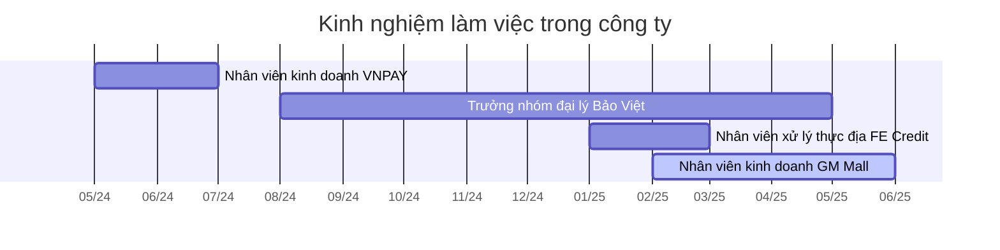

## Kinh nghiệm làm việc trong công ty

## Kỹ năng
### Lập trình
#### Web
- **Runtime:** Deno
- **Framework:** Fresh, Preact, Gatsby
- **Web builder:** Lume (TypeScript), Mkdocs (Python), WordPress (PHP) 
- **Server, network:** Deno Deploy, DirectAdmin, WinSCP
- **API:** Google Cloud, Fibery

#### Khác
- **Dữ liệu:** Python
- **Shell script:** AutoHotKey, Regex, PowerShell, sed/grep/awk, bash
- **Đồ thị:** Graphviz, Obsidian Dataview & Breadcrumbs, Neo4j, Cypher, vis.js
- **Android:** Tasker
- **CI/CD:** Docker

### Khác
- **Quản lý kiến thức và dự án:** OneNote, Google Keep (quản trị viên subreddit [r/GoogleKeep](https://www.reddit.com/r/GoogleKeep/)), Obsidian, Notion, Confluence, Trello
- **Kế toán:** hledger, Valueflows
- **Marketing:** Google Analytics, Google Tag Manager, Mouseflow, Facebook Bussiness
- **Thiết kế:** GraphViz, vis.js, Illustrator, Paint.NET, Inkscape, Scribus, ImageMagick
- **Xuất bản:** Typst, LaTeX, Zotero, Libre Office, jPdfBookmarks
- **Sản xuất video:** Movavi, Audacity, VLC
- **Productivity:** Anki, ManicTime, RescueTime
- **Ngôn ngữ:** Tiếng Việt, Tiếng Anh (TOELF: 90, GRE: 306), Tiếng Trung (sơ cấp)
- **Thể thao:** StarCraft: Broodwar, cờ vây, võ thuật, trượt ván, thể thao mạo hiểm

👉 Xem thêm: [How I use Google Keep](http://lyminhnhat.com/how-i-use-google-keep/?utm_source=CV+Lý+Minh+Nhật+(tiếng+Việt)&utm_medium=Tập+tin&utm_campaign=B2&utm_content=&utm_term=)

## Dự án, sản phẩm
| Năm  | Sản phẩm                                                                                                                                                                                                                                                                                                                                                         |
| ---- | ---------------------------------------------------------------------------------------------------------------------------------------------------------------------------------------------------------------------------------------------------------------------------------------------------------------------------------------------------------------- |
| 2025 | Chương trình tính hoa hồng và thay đổi định kỳ đóng phí cho đại lý bảo hiểm                                                                                                                                                                                                                                                                                      |
|      | [Quỹ tín dụng vi mô Quả Cầu](https://kiếmtiền.quảcầu.cc/📐Dự%20án/Giúp%20nhau%20thoát%20nợ/Quỹ/Quỹ%20tín%20dụng%20vi%20mô%20Quả%20Cầu?utm_source=CV+Lý+Minh+Nhật+(tiếng+Việt)+(Dự+án%2C+sản+phẩm)&utm_medium=Tập+tin&utm_campaign=B2&utm_content=&utm_term=)                                                                                               |
|      | [Nhóm giúp nhau kiếm tiền](https://kiếmtiền.quảcầu.cc/📐Dự%20án/Giúp%20nhau%20kiếm%20tiền?utm_source=CV+Lý+Minh+Nhật+(tiếng+Việt)+(Dự+án%2Csản+phẩm)&utm_medium=Tập+tin&utm_campaign=B2&utm_content=&utm_term=)                                                                                                                                                  |
| 2024 | [Cơ sở tri thức cộng đồng cho việc kiếm tiền](https://kiếmtiền.quảcầu.cc/?utm_source=CV+Lý+Minh+Nhật+(tiếng+Việt)&utm_medium=Tập+tin&utm_campaign=&utm_content=&utm_term=)                                                                                                                                                                                       |
|      | Hệ thống xử lý dữ liệu khách hàng cho nhân viên thu hồi nợ                                                                                                                                                                                                                                                                                                       |
|      | Tự động đăng bài lên mạng xã hội                                                                                                                                                                                                                                                                                                                                 |
|      | Tự động cào sự kiện từ nhiều trang web khác nhau vào Google Calendar                                                                                                                                                                                                                                                                                             |
|      | [đối ⊷ thoại: rút gọn liên kết cho các dự án đối thoại tiếng Việt](https://doi-thoai.deno.dev/?utm_source=CV+Lý+Minh+Nhật+(tiếng+Việt)&utm_medium=Tập+tin&utm_campaign=&utm_content=&utm_term=)                                                                                                                                                                  |
|      | [Các buổi đáp ứng nhu cầu học cách sử dụng công cụ và tư duy lập trình cho nhu cầu công việc](https://quảcầu.cc/cac-buoi-dap-ung-nhu-cau-hoc-cach-su-dung-cong-cu-va-tu-duy-lap-trinh-cho-nhu-cau-ca-nhan-hoac-nghien-cuu?utm_source=CV+Lý+Minh+Nhật+(tiếng+Việt)&utm_medium=Tập+tin&utm_campaign=Các+buổi+đáp+ứng+nhu+cầu+học+lập+trình&utm_content=&utm_term=) |
|      | [Cơ sở tri thức cộng đồng dành cho người dùng máy tính nâng cao và lập trình viên](https://lậptrình.quảcầu.cc/?utm_source=CV+Lý+Minh+Nhật+(tiếng+Việt)&utm_medium=Tập+tin&utm_campaign=&utm_content=&utm_term=)                                                                                                                                                  |
|      | [Kho địa điểm chọn nơi gặp mặt](https://obsidian.quảcầu.cc/📜Tài%20nguyên/Giải%20pháp%20kỹ%20thuật/Hậu%20cần/Nơi%20gặp%20mặt%20trực%20tiếp?utm_source=CV+Lý+Minh+Nhật+(tiếng+Việt)&utm_medium=Tập+tin&utm_campaign=C1&utm_content=&utm_term=)                                                                                                                    |
| 2023 | [Trấn Kỳ — Tự động phân loại, gắn nhãn thông tin theo thói quen và cách sắp xếp của riêng bạn bằng tiếng Việt tự nhiên](https://tranky.deno.dev/?utm_source=CV+Lý+Minh+Nhật+(tiếng+Việt)&utm_medium=Tập+tin&utm_campaign=&utm_content=&utm_term=)                                                                                                                |
|      | [Cơ sở tri thức cộng đồng về các môi trường nơi sự suy nghĩ diễn ra, và cách ứng dụng chúng vào quản lý dự án](https://obsidian.quảcầu.cc/?utm_source=CV+Lý+Minh+Nhật+(tiếng+Việt)&utm_medium=Tập+tin&utm_campaign=&utm_content=&utm_term=)                                                                                                                      |
| 2022 | Mạng kết nối nhu cầu                                                                                                                                                                                                                                                                                                                                             |
|      | [Graphvidian: plugin Graphviz cho Obsidian](https://doi-thoai.deno.dev/w0.2_.1)                                                                                                                                                                                                                                                                                  |
|      | [Đồ thị mạng lưới 100+ niềm tin phổ biến trong xã hội](https://quảcầu.cc/phan-tich-mot-mang-luoi-100-niem-tin?utm_source=CV+Lý+Minh+Nhật+(tiếng+Việt)&utm_medium=Tập+tin&utm_campaign=tâm+lý+học+nhận+thức%2Cthay+đổi+góc+nhìn%2CMạng+lưới+niềm+tin+và+mạng+lưới+câu+hỏi+liên+ngành%2Cniềm+tin%2Cmạng+lưới&utm_content=&utm_term=)                               |
|      | Mạng lưới người thân, bạn bè của người có niềm tin tiêu cực                                                                                                                                                                                                                                                                                                      |
|      | Chuỗi các bài dịch về chủ đề tự trị, đồng thuận, năng lực ra quyết định, sự riêng tư, thao túng, v.v.                                                                                                                                                                                                                                                            |
| 2018 | [Bộ sưu tập từ điển chuyên ngành](https://quảcầu.cc/tu-dien-chuyen-nganh?utm_source=CV+Lý+Minh+Nhật+(tiếng+Việt)&utm_medium=Tập+tin&utm_campaign=Bài+nổi+bật%2CTài+nguyên+khác%2CLàm+việc+hiệu+quả%2Cdịch%2Csách&utm_content=&utm_term=)                                                                                                                         |
| 2015 | [Bộ thẻ từ vựng tiếng Anh nâng cao (GRE Anki)](https://quảcầu.cc/bo-the-hoc-tu-vung-tieng-anh-nang-cao?utm_source=CV+Lý+Minh+Nhật+(tiếng+Việt)&utm_medium=Tập+tin&utm_campaign=Tài+nguyên+khác%2Cngôn+ngữ%2Cnét+nghĩa+ẩn%2CHọc+tiếng+Anh%2Ckhoa+học+nhận+thức&utm_content=&utm_term=)                                                                            |

## Buổi nói chuyện
- 2024, [Giới hạn của PKM nằm ở đâu: máy móc mình sử dụng hay chính người sử dụng nó?](https://www.youtube.com/watch?v=DIKNl3nVSxw)
- 2024, [Công nghệ và ký ức: trí nhớ của ta có còn nằm trong não của ta nữa không? - YouTube](https://www.youtube.com/watch?v=anEPsQCBPKI)
- 2022, Giới thiệu về Obsidian, Diễn đàn 2GROW — Diễn đàn Kết nối Thanh niên & Đội/Nhóm Thanh niên vì Bình đẳng giới

## Cộng tác
- **H2Q Art, 2019**, truyền thông cho vở múa đương đại Đa Thức
- **Nhã Nam, 2017**, biên tập cuốn sách Nếu Thì
- **VTC, 2016**, biên tập bản tin thời sự 19h
- **Dự án Vietnam Book Drive, 2014**, quản trị web

## Giáo dục chính quy
**Cử nhân khoa học, chuyên ngành Vật lý lý thuyết**
Hệ cử nhân tài năng, Trường Đại học KHTN TP.HCM, ‘10 – ‘14
- **Giải thưởng:** giải ba đồng đội Olympic Sinh viên Vật lý Quốc gia (2011)
- **Đề tài tốt nghiệp:** [Khảo sát năng lượng liên kết tĩnh điện trong protease của HIV-1](https://quảcầu.cc/nghien-cuu-khoa-hoc-phong-cach-truyen-tranh?utm_source=CV+Lý+Minh+Nhật+(tiếng+Việt)&utm_medium=Tập+tin&utm_campaign=Tài+nguyên+khác%2CLàm+việc+hiệu+quả&utm_content=&utm_term=)

## Kiến thức tự học
Đã tìm hiểu theo một *hệ thống*. Đó có thể là đọc giáo trình, tham dự một khóa học, nên ít nhiều cũng có một hệ thống lý thuyết. Dù kiến thức có thể bị quên do không sử dụng, 
, và khi gặp một chủ đề có thể nói ngay được nên tra cứu ở đâu bằng từ khóa gì.
Bloom

Danh mục được lấy từ [Outline of academic disciplines - Wikipedia](https://en.wikipedia.org/wiki/Outline_of_academic_disciplines)

### Nhân văn
- **Nghệ thuật:** Thời trang
- **Triết học:** Triết học phương Đông, triết học Deleuze và Guattari, mỹ học, chủ nghĩa hậu hiện đại, nhận thức luận, triết học đạo đức, triết học toán học, triết học công nghệ
- **Ngôn ngữ và văn học:** lý thuyết văn học, lý thuyết dịch thuật, tu từ và bố cục, thông diễn học

### Khoa học xã hội
- **Kinh doanh:** hệ thống thông tin, tài chính, tài chính thay thế, quản lý dự án, kế toán, bảo hiểm, nguồn nhân lực, sở hữu trí tuệ
- **Kinh tế học:** lịch sử kinh tế, kinh tế không dùng tiền, sản xuất đồng đẳng dựa trên nguồn lực chung, chủ nghĩa tư bản, chủ nghĩa cộng sản
- **Ngôn ngữ học:** ngôn ngữ học nhận thức, ngữ nghĩa học, thi pháp học, âm vị học, cú pháp học
- **Tâm lý học:** tâm lý học nhận thức, cảm xúc, tâm lý học xã hội, tâm lý trị liệu, tâm lý học tích cực, động lực học niềm tin
- **Nhân học:** nhân học văn hóa
- **Tổ chức học:** hành vi tổ chức, quản lý dự án

### Khoa học tự nhiên và khoa học hình thức
- **Toán:** hình học xạ ảnh, nhóm và biểu diễn, hệ phức tạp và động, giải tích hàm điều hòa, giải tích phức, lý thuyết đồ thị, lịch sử toán, lý thuyết thông tin, đại số kế toán
- **Khoa học máy tính:** kỹ thuật phần mềm, lập trình hướng đối tượng, xử lý ngôn ngữ tự nhiên, nhân văn số, khoa học dữ liệu, mạng, mật mã học, xử lý hình ảnh, trực quan hóa thông tin, cơ sở dữ liệu, khoa học tính toán, giải tích số, tin sinh học, điện toán lượng tử

### Khoa học ứng dụng
- **Kiến trúc và thiết kế:** nhận thức tăng cường, thiết kế đồ họa, công thái học, trải nghiệm người dùng
- **Khoa học thông tin:** thông tin và xã hội, tổ chức thông tin, lưu trữ và truy xuất thông tin điện tử
- **Báo chí, nghiên cứu phương tiện truyền thông và truyền thông:** báo chí số, truyền thông số, truyền thông học, giao tiếp liên nhân
- **Y học và sức khỏe:** viêm da dị ứng, giải phẫu người
- **Công tác xã hội**: phúc lợi trẻ em, tổ chức cộng đồng, sức khỏe tâm thần, tài chính vi mô

## Các khoá học, tập huấn
| Năm  | Tên chương trình                                                              | Đơn vị tổ chức                                                               |
| ---- | ----------------------------------------------------------------------------- | ---------------------------------------------------------------------------- |
| 2025 | Ngữ dụng học                                                                  | Kulavietnam                                                                  |
|      | Tự thuật về mình và cộng đồng mình                                            | Kulavietnam                                                                  |
| 2023 | ABG Open Special 8                                                            | ABG                                                                          |
|      | Nhân học                                                                      | Viện nghiên cứu Đời sống xã hội (SocialLife)                                 |
| 2022 | Bình đẳng giới, đa dạng và hòa nhập trong Thời trang & Làm đẹp (GEAI Fashion) | GEAI (Tổng lãnh sự quán Mỹ bảo trợ)                                          |
|      | Từ Chính Sách Bảo Vệ Quyền Riêng Tư Đến Thực Hành An Toàn Số                  | Viện Nghiên cứu Chính sách và Phát triển Truyền thông (IPS) & Oxfam Việt Nam |
|      | Triết học Deleuze và Guattari                                                 | Viện nghiên cứu Đời sống xã hội (SocialLife)                                 |
| 2021 | Trường học về các giá trị phổ quát (SUV 10)                                   | Trung tâm Thúc đẩy giáo dục và Nâng cao năng lực Phụ nữ (CEPEW)              |
|      | Triết học về giới (VGEM 2)                                                    | ECUE                                                                         |
|      | Đồng hành gieo mầm phát triển (DIF)                                           | ECUE                                                                         |
|      | I Commit                                                                      | Trung tâm Nghiên cứu phát triển bền vững (CSDS)                              |
|      | Trường học Phát triển Việt Nam (VSOD)                                         |                                                                              |
|      | Giao tiếp hạnh phúc                                                           | CMC parenting                                                                |
|      | Đạo và Đời                                                                    | Fred Hub                                                                     |
|      | Diễn đàn Thanh niên Kiến tạo                                                  | Trung tâm Nghiên cứu phát triển bền vững (CSDS)                              |
|      | Nhập môn Nhiếp ảnh                                                            | Mở                                                                           |
