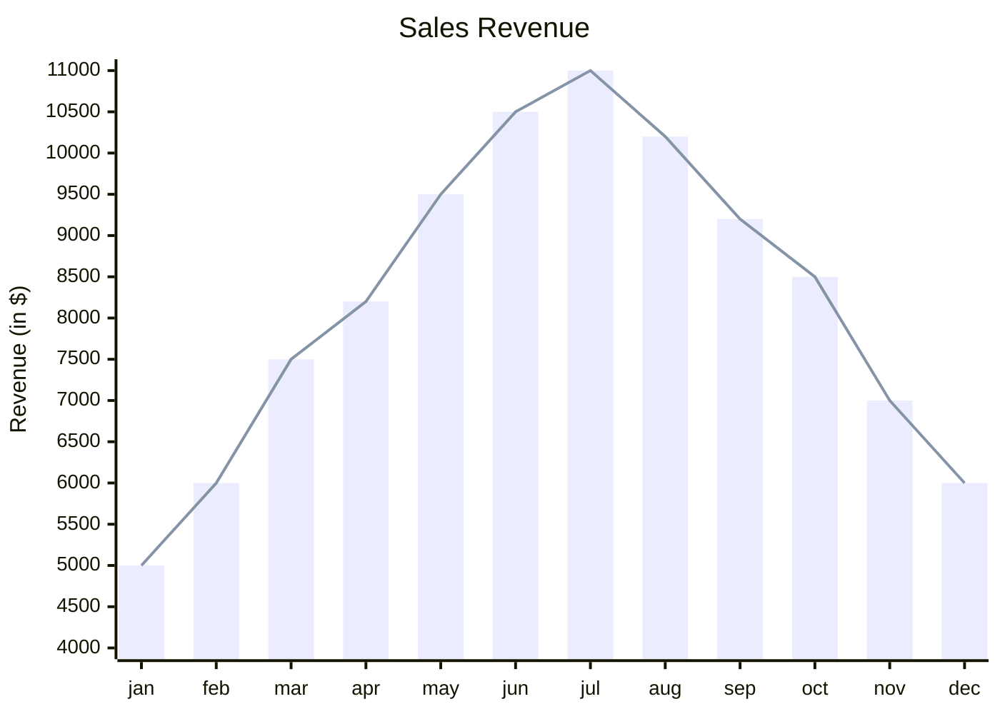

Nghiên cứu này có gấp không? Chắc chắn là không, nhưng nó đã lỡ chiếm tâm trí của Nhật rồi. Giờ nếu bỏ xuống thì gặp mấy nhược điểm này:
- Mất cái đà suy nghĩ đang có,
- Làm mình có thêm một thứ dở dang

Nghiên cứu này có quan trọng không? Nó sẽ tùy vào cách ta xét thế nào là quan trọng. Với nhu cầu [Trò chuyện vui vẻ và sâu sắc với những người mình quan tâm](../../../1%20Nhu%20c%E1%BA%A7u/Chi%E1%BA%BFn%20l%C6%B0%E1%BB%A3c%20%C4%91%C3%A1p%20%E1%BB%A9ng/Nhu%20c%E1%BA%A7u%20c%C3%A1%20nh%C3%A2n/X%C3%A3%20h%E1%BB%99i/Nhu%20c%E1%BA%A7u%20t%C3%ACnh%20c%E1%BA%A3m/Quan%20t%C3%A2m%20%C4%91%E1%BA%BFn%20%C4%91%E1%BB%9Di%20s%E1%BB%91ng%20c%E1%BB%A7a%20nhau/Tr%C3%B2%20chuy%E1%BB%87n%20vui%20v%E1%BA%BB%20v%C3%A0%20s%C3%A2u%20s%E1%BA%AFc%20v%E1%BB%9Bi%20nh%E1%BB%AFng%20ng%C6%B0%E1%BB%9Di%20m%C3%ACnh%20quan%20t%C3%A2m.md) thì chắc là nó không giúp ích gì, nhưng khi đi sâu vào việc giải quyết nhu cầu đó thì sẽ thấy một nhu cầu khác len lỏi nhiều là [Thu hút được sự đóng góp, lan toả chủ động của người có chuyên môn](../../../1%20Nhu%20c%E1%BA%A7u/Chi%E1%BA%BFn%20l%C6%B0%E1%BB%A3c%20%C4%91%C3%A1p%20%E1%BB%A9ng/Nhu%20c%E1%BA%A7u%20d%E1%BB%B1%20%C3%A1n/Nhu%20c%E1%BA%A7u%20v%E1%BB%81%20h%C3%A0nh%20vi%20ng%C6%B0%E1%BB%9Di%20d%C3%B9ng/Ng%C6%B0%E1%BB%9Di%20tham%20gia/Thu%20h%C3%BAt%20%C4%91%C6%B0%E1%BB%A3c%20s%E1%BB%B1%20%C4%91%C3%B3ng%20g%C3%B3p,%20lan%20to%E1%BA%A3%20ch%E1%BB%A7%20%C4%91%E1%BB%99ng%20c%E1%BB%A7a%20ng%C6%B0%E1%BB%9Di%20c%C3%B3%20chuy%C3%AAn%20m%C3%B4n.md) (cũng như của mọi người nói chung). Nhật đánh cược là nghiên cứu này sẽ đáp ứng nhu cầu đó khá tốt. Cơ sở cho nhận định này là vì chính Nhật cũng bị nó xui khiến khiến cho phải nghĩ đi nghĩ lại về nó, dù đã thấy nó không đáng để trở thành thứ được xếp thứ hạng ưu tiên cao nhất. Nên những người cũng ưa làm nghiên cứu như Nhật chắc cũng sẽ thấy chủ đề này hấp dẫn.

> [!Info] Bạn có biết?
> Năm 1969, khi điều trần trước Ủy ban liên hợp của Thượng viện Mỹ về năng lượng hạt nhân, trả lời câu hỏi liệu vật lý năng lượng cao có giá trị gì đối với việc bảo vệ quốc gia hay không, Robert Wilson, giám đốc FermiLab – viện máy gia tốc hạt năng lượng cao nhất thế giới lúc bấy giờ, đã nói: "Nó chẳng dính dáng gì trực tiếp đến bảo vệ quốc gia, ngoài việc làm cho quốc gia đáng được bảo vệ."

Nên Nhật thấy tuy nghiên cứu này có thể chưa tới mức là thứ xứng đáng có được sự ưu tiên cao nhất, nhưng việc chuyển sang làm cái khác sẽ không có lợi bằng tiếp tục làm nó.

> Khi một người dành thời gian để làm một điều đúng ở hiện tại, họ là một người cầu toàn không có khả năng ưu tiên. Còn khi một người dành thời gian làm một điều đúng trong quá khứ, họ là nghệ nhân bậc thầy với tầm nhìn xa trông rộng.
> — xkcd

### Lý do không chia sẻ
Tìm người chung mục tiêu sẽ có tác động lớn hơn
Khi nào thì có thể hô lên để giúp?
Cũng có nhiều người nổi tiếng sẵn rồi. Tự họ đã là chuyên gia. Nhưng cũng không thấy họ hô hào để giúp cho việc khác
Người giúp đỡ sẽ khó có động lực giúp nếu không thấy ý tưởng mình rõ ràng
[Chưa thấy có dự án nào nói về việc làm giảm tải gánh nặng công việc cho người bên cạnh mình](Ch%C6%B0a%20th%E1%BA%A5y%20c%C3%B3%20d%E1%BB%B1%20%C3%A1n%20n%C3%A0o%20n%C3%B3i%20v%E1%BB%81%20vi%E1%BB%87c%20l%C3%A0m%20gi%E1%BA%A3m%20t%E1%BA%A3i%20g%C3%A1nh%20n%E1%BA%B7ng%20c%C3%B4ng%20vi%E1%BB%87c%20cho%20ng%C6%B0%E1%BB%9Di%20b%C3%AAn%20c%E1%BA%A1nh%20m%C3%ACnh.md)

Vậy nó có xứng đáng để xem đây là ưu tiên cao nhất không, khi mà việc làm nó là chi phí cơ hội cho những việc khác? Giám đốc FermiLab nói thì nói vậy, nhưng vẫn phải ra quyết định xem dự án nào là dự án nên tập trung nguồn lực.
Những thứ khác có thể chuyển giao cho người khác
Phải dành thời gian để hoàn thiện câu hỏi, và nó bắt nguồn từ vision. Trong khi đầu mình đang xử lý task. Nên bản thân việc đặt câu hỏi cũng là một sự phân tâm
