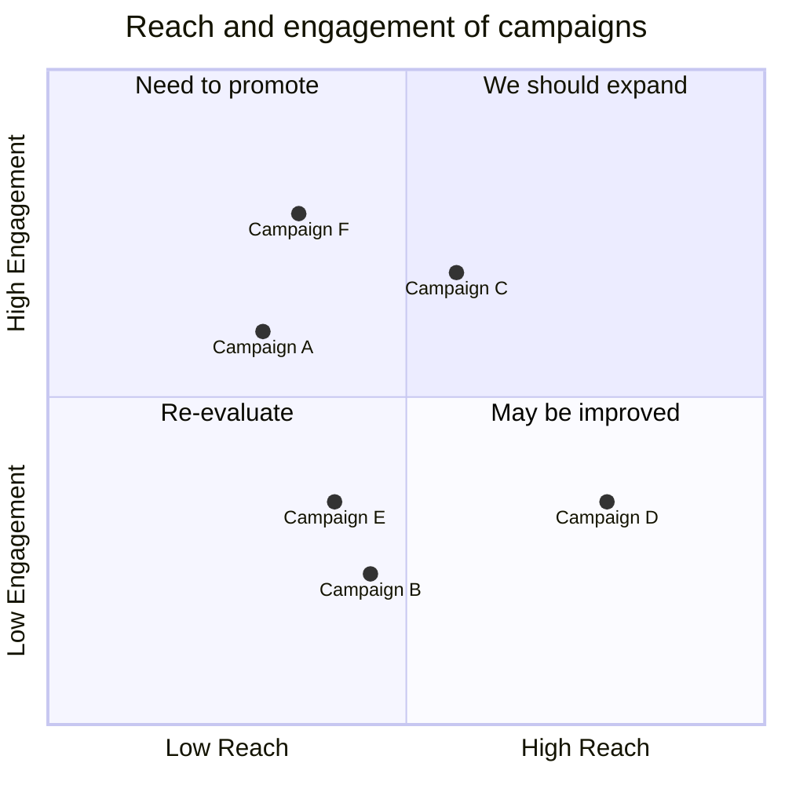

## Phân loại theo mảng
### [Xây dựng tổ chức mà người tham gia không cần tham gia vì trách nhiệm](../../3%20S%E1%BA%A3n%20ph%E1%BA%A9m/A%20M%E1%BA%A1ng%20k%E1%BA%BFt%20n%E1%BB%91i%20nhu%20c%E1%BA%A7u/X%C3%A2y%20d%E1%BB%B1ng%20t%E1%BB%95%20ch%E1%BB%A9c%20m%C3%A0%20ng%C6%B0%E1%BB%9Di%20tham%20gia%20kh%C3%B4ng%20c%E1%BA%A7n%20tham%20gia%20v%C3%AC%20tr%C3%A1ch%20nhi%E1%BB%87m.md)
Làm cách nào để thấy rõ các kết nối đã có sẵn trong cộng đồng Quả Cầu, dẫn đến nhu cầu lập pháp nhân cho Quả Cầu:
- Đón các dòng tiền bền vững, chính danh
- Hỗ trợ pháp lí cho các giao dịch của thành viên Quả Cầu với cộng đồng
- Có nguồn lực bền vững để xây dựng hệ thống quản trị thành công và trao truyền lại cho cộng đồng, giảm phụ thuộc vào founder trong việc vận hành và phát triển Quả Cầu
 
Thảo luận về mong muốn phát triển Quả Cầu của các thành viên hiện tại:
- Quả Cầu là hợp lực của tất cả thành viên trong cộng đồng. Mong muốn và đóng góp của mỗi thành viên là lực đẩy giúp Quả Cầu đến nơi Quả Cầu cần đến.
- Khởi động thảo luận chung để nhìn thấy những thành viên còn muốn chung tay thúc đẩy Quả Cầu phát triển.

i see u:
- Lập thư viện nguồn lực và nhu cầu hiện có của cộng đồng Quả Cầu.
- aai tham gia cũng nhìn thấy nhau, từ đó tạo ra hiện tượng trồi sinh (emergence), thúc đẩy Quả Cầu một cách tự nhiên

### Có hạn chót, quan trọng 
[Mọi người không còn phải lo lắng cơm áo gạo tiền nữa](../../1%20Nhu%20c%E1%BA%A7u/Chi%E1%BA%BFn%20l%C6%B0%E1%BB%A3c%20%C4%91%C3%A1p%20%E1%BB%A9ng/Nhu%20c%E1%BA%A7u%20s%E1%BB%A9%20m%E1%BA%A1ng/Ph%C3%A1t%20tri%E1%BB%83n%20b%E1%BB%81n%20v%E1%BB%AFng/C%C3%B4ng%20vi%E1%BB%87c/M%E1%BB%8Di%20ng%C6%B0%E1%BB%9Di%20kh%C3%B4ng%20c%C3%B2n%20ph%E1%BA%A3i%20lo%20l%E1%BA%AFng%20c%C6%A1m%20%C3%A1o%20g%E1%BA%A1o%20ti%E1%BB%81n%20n%E1%BB%AFa.md):
- [Giúp nhân viên đạt được chỉ tiêu](../../1%20Nhu%20c%E1%BA%A7u/Chi%E1%BA%BFn%20l%C6%B0%E1%BB%A3c%20%C4%91%C3%A1p%20%E1%BB%A9ng/Nhu%20c%E1%BA%A7u%20s%E1%BB%A9%20m%E1%BA%A1ng/Ph%C3%A1t%20tri%E1%BB%83n%20b%E1%BB%81n%20v%E1%BB%AFng/C%C3%B4ng%20vi%E1%BB%87c/Gi%C3%BAp%20nh%C3%A2n%20vi%C3%AAn%20%C4%91%E1%BA%A1t%20%C4%91%C6%B0%E1%BB%A3c%20ch%E1%BB%89%20ti%C3%AAu.md). [Giúp bạn bè thoát nợ](../../1%20Nhu%20c%E1%BA%A7u/Chi%E1%BA%BFn%20l%C6%B0%E1%BB%A3c%20%C4%91%C3%A1p%20%E1%BB%A9ng/Nhu%20c%E1%BA%A7u%20s%E1%BB%A9%20m%E1%BA%A1ng/Ph%C3%A1t%20tri%E1%BB%83n%20b%E1%BB%81n%20v%E1%BB%AFng/C%C3%B4ng%20vi%E1%BB%87c/Gi%C3%BAp%20b%E1%BA%A1n%20b%C3%A8%20tho%C3%A1t%20n%E1%BB%A3.md)
- [Vay được 100 tr](../../1%20Nhu%20c%E1%BA%A7u/Chi%E1%BA%BFn%20l%C6%B0%E1%BB%A3c%20%C4%91%C3%A1p%20%E1%BB%A9ng/Nhu%20c%E1%BA%A7u%20d%E1%BB%B1%20%C3%A1n/Nhu%20c%E1%BA%A7u%20c%C3%B4ng%20vi%E1%BB%87c/V%E1%BA%ADn%20h%C3%A0nh/K%E1%BA%BF%20to%C3%A1n/Vay%20%C4%91%C6%B0%E1%BB%A3c%20100%20tr.md)
- [Hỗ trợ xây dựng mô hình kinh doanh](../../3%20S%E1%BA%A3n%20ph%E1%BA%A9m/B%20T%C6%B0%20b%E1%BA%A3n%20v%C3%A0%20c%C3%A1c%20h%C3%ACnh%20th%C3%A1i%20kinh%20t%E1%BA%BF%20thay%20th%E1%BA%BF/H%E1%BB%97%20tr%E1%BB%A3%20x%C3%A2y%20d%E1%BB%B1ng%20m%C3%B4%20h%C3%ACnh%20kinh%20doanh.md)
- [Lập quỹ tín dụng vi mô](../../3%20S%E1%BA%A3n%20ph%E1%BA%A9m/B%20T%C6%B0%20b%E1%BA%A3n%20v%C3%A0%20c%C3%A1c%20h%C3%ACnh%20th%C3%A1i%20kinh%20t%E1%BA%BF%20thay%20th%E1%BA%BF/L%E1%BA%ADp%20qu%E1%BB%B9%20t%C3%ADn%20d%E1%BB%A5ng%20vi%20m%C3%B4.md)
- [Xây dựng hợp tác xã nhân viên](../../3%20S%E1%BA%A3n%20ph%E1%BA%A9m/B%20T%C6%B0%20b%E1%BA%A3n%20v%C3%A0%20c%C3%A1c%20h%C3%ACnh%20th%C3%A1i%20kinh%20t%E1%BA%BF%20thay%20th%E1%BA%BF/X%C3%A2y%20d%E1%BB%B1ng%20h%E1%BB%A3p%20t%C3%A1c%20x%C3%A3%20nh%C3%A2n%20vi%C3%AAn.md)
- [Xây dựng cộng đồng](../../1%20Nhu%20c%E1%BA%A7u/Chi%E1%BA%BFn%20l%C6%B0%E1%BB%A3c%20%C4%91%C3%A1p%20%E1%BB%A9ng/Nhu%20c%E1%BA%A7u%20d%E1%BB%B1%20%C3%A1n/Nhu%20c%E1%BA%A7u%20c%C3%B4ng%20vi%E1%BB%87c/H%E1%BB%A3p%20t%C3%A1c,%20ph%C3%A1t%20tri%E1%BB%83n%20c%E1%BB%99ng%20%C4%91%E1%BB%93ng/X%C3%A2y%20d%E1%BB%B1ng%20c%E1%BB%99ng%20%C4%91%E1%BB%93ng.md)
- [Xây dựng mạng lưới những người muốn xây dựng mạng lưới](../../1%20Nhu%20c%E1%BA%A7u/Chi%E1%BA%BFn%20l%C6%B0%E1%BB%A3c%20%C4%91%C3%A1p%20%E1%BB%A9ng/Nhu%20c%E1%BA%A7u%20s%E1%BB%A9%20m%E1%BA%A1ng/Ph%C3%A1t%20tri%E1%BB%83n%20b%E1%BB%81n%20v%E1%BB%AFng/Th%C3%BAc%20%C4%91%E1%BA%A9y%20s%E1%BB%B1%20h%E1%BB%A3p%20t%C3%A1c/X%C3%A2y%20d%E1%BB%B1ng%20m%E1%BA%A1ng%20l%C6%B0%E1%BB%9Bi%20nh%E1%BB%AFng%20ng%C6%B0%E1%BB%9Di%20mu%E1%BB%91n%20x%C3%A2y%20d%E1%BB%B1ng%20m%E1%BA%A1ng%20l%C6%B0%E1%BB%9Bi.md)
- [Xóa bỏ tư duy khan hiếm](../../1%20Nhu%20c%E1%BA%A7u/Chi%E1%BA%BFn%20l%C6%B0%E1%BB%A3c%20%C4%91%C3%A1p%20%E1%BB%A9ng/Nhu%20c%E1%BA%A7u%20s%E1%BB%A9%20m%E1%BA%A1ng/T%C3%B2%20m%C3%B2,%20thong%20th%E1%BA%A3,%20kho%C3%A1ng%20%C4%91%E1%BA%A1t,%20bi%E1%BA%BFn%20h%C3%B3a/X%C3%B3a%20b%E1%BB%8F%20t%C6%B0%20duy%20khan%20hi%E1%BA%BFm.md)

### Quan trọng, không hạn chót
[Có tình nguyện viên lập trình](../../1%20Nhu%20c%E1%BA%A7u/Chi%E1%BA%BFn%20l%C6%B0%E1%BB%A3c%20%C4%91%C3%A1p%20%E1%BB%A9ng/Nhu%20c%E1%BA%A7u%20d%E1%BB%B1%20%C3%A1n/C%C3%B3%20t%C3%ACnh%20nguy%E1%BB%87n%20vi%C3%AAn%20l%E1%BA%ADp%20tr%C3%ACnh.md). [Có người kế tục](../../1%20Nhu%20c%E1%BA%A7u/Chi%E1%BA%BFn%20l%C6%B0%E1%BB%A3c%20%C4%91%C3%A1p%20%E1%BB%A9ng/Nhu%20c%E1%BA%A7u%20d%E1%BB%B1%20%C3%A1n/Nhu%20c%E1%BA%A7u%20v%E1%BB%81%20h%C3%A0nh%20vi%20ng%C6%B0%E1%BB%9Di%20d%C3%B9ng/C%C3%B3%20ng%C6%B0%E1%BB%9Di%20k%E1%BA%BF%20t%E1%BB%A5c.md)
[Quản trị ngang hàng](../../1%20Nhu%20c%E1%BA%A7u/Chi%E1%BA%BFn%20l%C6%B0%E1%BB%A3c%20%C4%91%C3%A1p%20%E1%BB%A9ng/Nhu%20c%E1%BA%A7u%20d%E1%BB%B1%20%C3%A1n/Nhu%20c%E1%BA%A7u%20c%C3%B4ng%20vi%E1%BB%87c/V%E1%BA%ADn%20h%C3%A0nh/Qu%E1%BA%A3n%20tr%E1%BB%8B/Qu%E1%BA%A3n%20tr%E1%BB%8B%20ngang%20h%C3%A0ng.md)
[Nắm bắt hoạt động của nhau](../../1%20Nhu%20c%E1%BA%A7u/Chi%E1%BA%BFn%20l%C6%B0%E1%BB%A3c%20%C4%91%C3%A1p%20%E1%BB%A9ng/Nhu%20c%E1%BA%A7u%20d%E1%BB%B1%20%C3%A1n/Nhu%20c%E1%BA%A7u%20c%C3%B4ng%20vi%E1%BB%87c/V%E1%BA%ADn%20h%C3%A0nh/Qu%E1%BA%A3n%20tr%E1%BB%8B/N%E1%BA%AFm%20b%E1%BA%AFt%20ho%E1%BA%A1t%20%C4%91%E1%BB%99ng%20c%E1%BB%A7a%20nhau.md)

[Có cộng đồng phát triển](../../1%20Nhu%20c%E1%BA%A7u/Chi%E1%BA%BFn%20l%C6%B0%E1%BB%A3c%20%C4%91%C3%A1p%20%E1%BB%A9ng/Nhu%20c%E1%BA%A7u%20d%E1%BB%B1%20%C3%A1n/Nhu%20c%E1%BA%A7u%20c%C3%B4ng%20vi%E1%BB%87c/H%E1%BB%A3p%20t%C3%A1c,%20ph%C3%A1t%20tri%E1%BB%83n%20c%E1%BB%99ng%20%C4%91%E1%BB%93ng/C%C3%B3%20c%E1%BB%99ng%20%C4%91%E1%BB%93ng%20ph%C3%A1t%20tri%E1%BB%83n.md):
- [Xây dựng mạng kết nối nhu cầu](../../3%20S%E1%BA%A3n%20ph%E1%BA%A9m/A%20M%E1%BA%A1ng%20k%E1%BA%BFt%20n%E1%BB%91i%20nhu%20c%E1%BA%A7u/X%C3%A2y%20d%E1%BB%B1ng%20m%E1%BA%A1ng%20k%E1%BA%BFt%20n%E1%BB%91i%20nhu%20c%E1%BA%A7u.md)
- [Xây dựng cộng đồng có chủ đích](../../3%20S%E1%BA%A3n%20ph%E1%BA%A9m/B%20T%C6%B0%20b%E1%BA%A3n%20v%C3%A0%20c%C3%A1c%20h%C3%ACnh%20th%C3%A1i%20kinh%20t%E1%BA%BF%20thay%20th%E1%BA%BF/X%C3%A2y%20d%E1%BB%B1ng%20c%E1%BB%99ng%20%C4%91%E1%BB%93ng%20c%C3%B3%20ch%E1%BB%A7%20%C4%91%C3%ADch.md)
- [Xây dựng câu lạc bộ tiêu dùng](../../3%20S%E1%BA%A3n%20ph%E1%BA%A9m/B%20T%C6%B0%20b%E1%BA%A3n%20v%C3%A0%20c%C3%A1c%20h%C3%ACnh%20th%C3%A1i%20kinh%20t%E1%BA%BF%20thay%20th%E1%BA%BF/X%C3%A2y%20d%E1%BB%B1ng%20c%C3%A2u%20l%E1%BA%A1c%20b%E1%BB%99%20ti%C3%AAu%20d%C3%B9ng.md)
- [Xây dựng mạng lưới những người muốn xây dựng mạng lưới](../../1%20Nhu%20c%E1%BA%A7u/Chi%E1%BA%BFn%20l%C6%B0%E1%BB%A3c%20%C4%91%C3%A1p%20%E1%BB%A9ng/Nhu%20c%E1%BA%A7u%20s%E1%BB%A9%20m%E1%BA%A1ng/Ph%C3%A1t%20tri%E1%BB%83n%20b%E1%BB%81n%20v%E1%BB%AFng/Th%C3%BAc%20%C4%91%E1%BA%A9y%20s%E1%BB%B1%20h%E1%BB%A3p%20t%C3%A1c/X%C3%A2y%20d%E1%BB%B1ng%20m%E1%BA%A1ng%20l%C6%B0%E1%BB%9Bi%20nh%E1%BB%AFng%20ng%C6%B0%E1%BB%9Di%20mu%E1%BB%91n%20x%C3%A2y%20d%E1%BB%B1ng%20m%E1%BA%A1ng%20l%C6%B0%E1%BB%9Bi.md)
- [Thúc đẩy địa phương hóa](../../1%20Nhu%20c%E1%BA%A7u/Chi%E1%BA%BFn%20l%C6%B0%E1%BB%A3c%20%C4%91%C3%A1p%20%E1%BB%A9ng/Nhu%20c%E1%BA%A7u%20s%E1%BB%A9%20m%E1%BA%A1ng/Ph%C3%A1t%20tri%E1%BB%83n%20b%E1%BB%81n%20v%E1%BB%AFng/V%C4%83n%20h%C3%B3a%20b%E1%BA%A3n%20%C4%91%E1%BB%8Ba/Th%C3%BAc%20%C4%91%E1%BA%A9y%20%C4%91%E1%BB%8Ba%20ph%C6%B0%C6%A1ng%20h%C3%B3a.md)

[Xây dựng nhóm hỗ trợ cho người tự học quản lý dự án hoặc lập trình](../../3%20S%E1%BA%A3n%20ph%E1%BA%A9m/C%20Qu%E1%BA%A3n%20l%C3%BD%20d%E1%BB%B1%20%C3%A1n%20v%C3%A0%20c%C3%B4ng%20c%E1%BB%A5%20ngh%C4%A9/X%C3%A2y%20d%E1%BB%B1ng%20nh%C3%B3m%20h%E1%BB%97%20tr%E1%BB%A3%20cho%20ng%C6%B0%E1%BB%9Di%20t%E1%BB%B1%20h%E1%BB%8Dc%20qu%E1%BA%A3n%20l%C3%BD%20d%E1%BB%B1%20%C3%A1n%20ho%E1%BA%B7c%20l%E1%BA%ADp%20tr%C3%ACnh.md) 
- [Hỗ trợ tự động hoá, viết script](../../1%20Nhu%20c%E1%BA%A7u/Chi%E1%BA%BFn%20l%C6%B0%E1%BB%A3c%20%C4%91%C3%A1p%20%E1%BB%A9ng/Nhu%20c%E1%BA%A7u%20s%E1%BB%A9%20m%E1%BA%A1ng/Ph%C3%A1t%20tri%E1%BB%83n%20b%E1%BB%81n%20v%E1%BB%AFng/Th%C3%BAc%20%C4%91%E1%BA%A9y%20s%E1%BB%B1%20h%E1%BB%A3p%20t%C3%A1c/H%E1%BB%87%20th%E1%BB%91ng%20th%C3%B4ng%20tin/H%E1%BB%97%20tr%E1%BB%A3%20t%E1%BB%B1%20%C4%91%E1%BB%99ng%20ho%C3%A1,%20vi%E1%BA%BFt%20script.md)
- [Hỗ trợ xây dựng hệ thống quản lý](../../1%20Nhu%20c%E1%BA%A7u/Chi%E1%BA%BFn%20l%C6%B0%E1%BB%A3c%20%C4%91%C3%A1p%20%E1%BB%A9ng/Nhu%20c%E1%BA%A7u%20s%E1%BB%A9%20m%E1%BA%A1ng/Ph%C3%A1t%20tri%E1%BB%83n%20b%E1%BB%81n%20v%E1%BB%AFng/Th%C3%BAc%20%C4%91%E1%BA%A9y%20s%E1%BB%B1%20h%E1%BB%A3p%20t%C3%A1c/H%E1%BB%87%20th%E1%BB%91ng%20th%C3%B4ng%20tin/H%E1%BB%97%20tr%E1%BB%A3%20x%C3%A2y%20d%E1%BB%B1ng%20h%E1%BB%87%20th%E1%BB%91ng%20qu%E1%BA%A3n%20l%C3%BD.md)
- [Hỗ trợ lập web](../../1%20Nhu%20c%E1%BA%A7u/Chi%E1%BA%BFn%20l%C6%B0%E1%BB%A3c%20%C4%91%C3%A1p%20%E1%BB%A9ng/Nhu%20c%E1%BA%A7u%20s%E1%BB%A9%20m%E1%BA%A1ng/Ph%C3%A1t%20tri%E1%BB%83n%20b%E1%BB%81n%20v%E1%BB%AFng/Th%C3%BAc%20%C4%91%E1%BA%A9y%20s%E1%BB%B1%20h%E1%BB%A3p%20t%C3%A1c/H%E1%BB%87%20th%E1%BB%91ng%20th%C3%B4ng%20tin/H%E1%BB%97%20tr%E1%BB%A3%20l%E1%BA%ADp%20web.md)
- [Giúp người thụ hưởng truy vấn, liên kết thông tin từ kho khác và tự động hoá việc đóng góp dữ liệu vào chúng](../../1%20Nhu%20c%E1%BA%A7u/Chi%E1%BA%BFn%20l%C6%B0%E1%BB%A3c%20%C4%91%C3%A1p%20%E1%BB%A9ng/Nhu%20c%E1%BA%A7u%20d%E1%BB%B1%20%C3%A1n/Nhu%20c%E1%BA%A7u%20c%C3%B4ng%20vi%E1%BB%87c/H%E1%BB%A3p%20t%C3%A1c,%20ph%C3%A1t%20tri%E1%BB%83n%20c%E1%BB%99ng%20%C4%91%E1%BB%93ng/Gi%C3%BAp%20truy%20v%E1%BA%A5n,%20li%C3%AAn%20k%E1%BA%BFt%20th%C3%B4ng%20tin%20t%E1%BB%AB%20kho%20kh%C3%A1c%20v%C3%A0%20t%E1%BB%B1%20%C4%91%E1%BB%99ng%20ho%C3%A1%20vi%E1%BB%87c%20%C4%91%C3%B3ng%20g%C3%B3p%20d%E1%BB%AF%20li%E1%BB%87u%20v%C3%A0o%20ch%C3%BAng.md)
- [Hỗ trợ người thụ hưởng thử nghiệm ý tưởng mới và kiểm tra giả thiết ngay khi chúng vừa được nghĩ ra](../../1%20Nhu%20c%E1%BA%A7u/Chi%E1%BA%BFn%20l%C6%B0%E1%BB%A3c%20%C4%91%C3%A1p%20%E1%BB%A9ng/Nhu%20c%E1%BA%A7u%20s%E1%BB%A9%20m%E1%BA%A1ng/Ph%C3%A1t%20tri%E1%BB%83n%20b%E1%BB%81n%20v%E1%BB%AFng/Th%C3%BAc%20%C4%91%E1%BA%A9y%20s%E1%BB%B1%20h%E1%BB%A3p%20t%C3%A1c/H%E1%BB%87%20th%E1%BB%91ng%20th%C3%B4ng%20tin/H%E1%BB%97%20tr%E1%BB%A3%20th%E1%BB%AD%20nghi%E1%BB%87m%20%C3%BD%20t%C6%B0%E1%BB%9Fng%20m%E1%BB%9Bi%20v%C3%A0%20ki%E1%BB%83m%20tra%20gi%E1%BA%A3%20thi%E1%BA%BFt%20ngay%20khi%20ch%C3%BAng%20v%E1%BB%ABa%20%C4%91%C6%B0%E1%BB%A3c%20ngh%C4%A9%20ra.md) 
- [Tăng số lượng các lập trình viên chân đất (barefoot developer) viết được phần mềm như nấu ăn ở nhà (homecooked software)](../../1%20Nhu%20c%E1%BA%A7u/Chi%E1%BA%BFn%20l%C6%B0%E1%BB%A3c%20%C4%91%C3%A1p%20%E1%BB%A9ng/Nhu%20c%E1%BA%A7u%20s%E1%BB%A9%20m%E1%BA%A1ng/Ph%C3%A1t%20tri%E1%BB%83n%20b%E1%BB%81n%20v%E1%BB%AFng/Th%C3%BAc%20%C4%91%E1%BA%A9y%20s%E1%BB%B1%20h%E1%BB%A3p%20t%C3%A1c/H%E1%BB%87%20th%E1%BB%91ng%20th%C3%B4ng%20tin/T%C4%83ng%20s%E1%BB%91%20l%C6%B0%E1%BB%A3ng%20c%C3%A1c%20l%E1%BA%ADp%20tr%C3%ACnh%20vi%C3%AAn%20ch%C3%A2n%20%C4%91%E1%BA%A5t%20(barefoot%20developer)%20vi%E1%BA%BFt%20%C4%91%C6%B0%E1%BB%A3c%20ph%E1%BA%A7n%20m%E1%BB%81m%20nh%C6%B0%20n%E1%BA%A5u%20%C4%83n%20%E1%BB%9F%20nh%C3%A0%20(homecooked%20software).md)
- [Xây dựng các kho tài nguyên chung](../../3%20S%E1%BA%A3n%20ph%E1%BA%A9m/C%20Qu%E1%BA%A3n%20l%C3%BD%20d%E1%BB%B1%20%C3%A1n%20v%C3%A0%20c%C3%B4ng%20c%E1%BB%A5%20ngh%C4%A9/X%C3%A2y%20d%E1%BB%B1ng%20c%C3%A1c%20kho%20t%C3%A0i%20nguy%C3%AAn%20chung.md)
- [Phổ cập việc sử dụng giấy phép tự do](../../1%20Nhu%20c%E1%BA%A7u/Chi%E1%BA%BFn%20l%C6%B0%E1%BB%A3c%20%C4%91%C3%A1p%20%E1%BB%A9ng/Nhu%20c%E1%BA%A7u%20s%E1%BB%A9%20m%E1%BA%A1ng/Tri%20th%E1%BB%A9c/T%E1%BB%B1%20do%20tri%20th%E1%BB%A9c/Ph%E1%BB%95%20c%E1%BA%ADp%20vi%E1%BB%87c%20s%E1%BB%AD%20d%E1%BB%A5ng%20gi%E1%BA%A5y%20ph%C3%A9p%20t%E1%BB%B1%20do.md)
- [Chia sẻ kho tri thức của mình cho mọi người](../../1%20Nhu%20c%E1%BA%A7u/Chi%E1%BA%BFn%20l%C6%B0%E1%BB%A3c%20%C4%91%C3%A1p%20%E1%BB%A9ng/Nhu%20c%E1%BA%A7u%20d%E1%BB%B1%20%C3%A1n/Nhu%20c%E1%BA%A7u%20c%C3%B4ng%20vi%E1%BB%87c/Vi%E1%BA%BFt%20v%C3%A0%20chia%20s%E1%BA%BB%20tri%20th%E1%BB%A9c/Chia%20s%E1%BA%BB%20kho%20tri%20th%E1%BB%A9c%20c%E1%BB%A7a%20m%C3%ACnh%20cho%20m%E1%BB%8Di%20ng%C6%B0%E1%BB%9Di.md)

[Xây dựng hệ thống quản lý niềm tin giúp thúc đẩy sự đối thoại](../../3%20S%E1%BA%A3n%20ph%E1%BA%A9m/F%20Ni%E1%BB%81m%20tin%20v%C3%A0%20%C4%91%E1%BB%91i%20tho%E1%BA%A1i/X%C3%A2y%20d%E1%BB%B1ng%20h%E1%BB%87%20th%E1%BB%91ng%20qu%E1%BA%A3n%20l%C3%BD%20ni%E1%BB%81m%20tin%20gi%C3%BAp%20th%C3%BAc%20%C4%91%E1%BA%A9y%20s%E1%BB%B1%20%C4%91%E1%BB%91i%20tho%E1%BA%A1i.md). [Xây dựng mạng lưới người thân, bạn bè của người có niềm tin tiêu cực](X%C3%A2y%20d%E1%BB%B1ng%20m%E1%BA%A1ng%20l%C6%B0%E1%BB%9Bi%20ng%C6%B0%E1%BB%9Di%20th%C3%A2n,%20b%E1%BA%A1n%20b%C3%A8%20c%E1%BB%A7a%20ng%C6%B0%E1%BB%9Di%20c%C3%B3%20ni%E1%BB%81m%20tin%20ti%C3%AAu%20c%E1%BB%B1c.md):
- [Xóa bỏ sự mỉa mai, thù ghét, bắt nạt](../../1%20Nhu%20c%E1%BA%A7u/Chi%E1%BA%BFn%20l%C6%B0%E1%BB%A3c%20%C4%91%C3%A1p%20%E1%BB%A9ng/Nhu%20c%E1%BA%A7u%20s%E1%BB%A9%20m%E1%BA%A1ng/Tr%C3%A2n%20tr%E1%BB%8Dng%20ng%C6%B0%E1%BB%9Di%20kh%C3%A1c/X%C3%B3a%20b%E1%BB%8F%20s%E1%BB%B1%20m%E1%BB%89a%20mai,%20th%C3%B9%20gh%C3%A9t,%20b%E1%BA%AFt%20n%E1%BA%A1t.md) 
- [Tạo môi trường để những người thù ghét người khác muốn trò chuyện với người họ thù ghét](../../1%20Nhu%20c%E1%BA%A7u/Chi%E1%BA%BFn%20l%C6%B0%E1%BB%A3c%20%C4%91%C3%A1p%20%E1%BB%A9ng/Nhu%20c%E1%BA%A7u%20s%E1%BB%A9%20m%E1%BA%A1ng/%C4%90%E1%BB%91i%20tho%E1%BA%A1i/%C4%90%E1%BB%91i%20di%E1%BB%87n/T%E1%BA%A1o%20m%C3%B4i%20tr%C6%B0%E1%BB%9Dng%20%C4%91%E1%BB%83%20nh%E1%BB%AFng%20ng%C6%B0%E1%BB%9Di%20th%C3%B9%20gh%C3%A9t%20ng%C6%B0%E1%BB%9Di%20kh%C3%A1c%20mu%E1%BB%91n%20tr%C3%B2%20chuy%E1%BB%87n%20v%E1%BB%9Bi%20ng%C6%B0%E1%BB%9Di%20h%E1%BB%8D%20th%C3%B9%20gh%C3%A9t.md) 
- [Xóa bỏ thuốc lá](../../1%20Nhu%20c%E1%BA%A7u/Chi%E1%BA%BFn%20l%C6%B0%E1%BB%A3c%20%C4%91%C3%A1p%20%E1%BB%A9ng/Nhu%20c%E1%BA%A7u%20s%E1%BB%A9%20m%E1%BA%A1ng/Ph%C3%A1t%20tri%E1%BB%83n%20b%E1%BB%81n%20v%E1%BB%AFng/S%E1%BB%A9c%20kh%E1%BB%8Fe/X%C3%B3a%20b%E1%BB%8F%20thu%E1%BB%91c%20l%C3%A1.md)

[Xây dựng nhóm nghiên cứu liên ngành](X%C3%A2y%20d%E1%BB%B1ng%20nh%C3%B3m%20nghi%C3%AAn%20c%E1%BB%A9u%20li%C3%AAn%20ng%C3%A0nh.md):
- [Vá lại các lỗ hổng trong kiến thức, niềm tin của mình](../../1%20Nhu%20c%E1%BA%A7u/Chi%E1%BA%BFn%20l%C6%B0%E1%BB%A3c%20%C4%91%C3%A1p%20%E1%BB%A9ng/Nhu%20c%E1%BA%A7u%20c%C3%A1%20nh%C3%A2n/Ki%E1%BA%BFn%20th%E1%BB%A9c,%20g%C3%B3c%20nh%C3%ACn/L%E1%BA%ADp%20lu%E1%BA%ADn/V%C3%A1%20l%E1%BA%A1i%20c%C3%A1c%20l%E1%BB%97%20h%E1%BB%95ng%20trong%20ki%E1%BA%BFn%20th%E1%BB%A9c,%20ni%E1%BB%81m%20tin%20c%E1%BB%A7a%20m%C3%ACnh.md) 
- [Thu hút được sự đóng góp, lan toả chủ động của người có chuyên môn](../../1%20Nhu%20c%E1%BA%A7u/Chi%E1%BA%BFn%20l%C6%B0%E1%BB%A3c%20%C4%91%C3%A1p%20%E1%BB%A9ng/Nhu%20c%E1%BA%A7u%20d%E1%BB%B1%20%C3%A1n/Nhu%20c%E1%BA%A7u%20v%E1%BB%81%20h%C3%A0nh%20vi%20ng%C6%B0%E1%BB%9Di%20d%C3%B9ng/Ng%C6%B0%E1%BB%9Di%20tham%20gia/Thu%20h%C3%BAt%20%C4%91%C6%B0%E1%BB%A3c%20s%E1%BB%B1%20%C4%91%C3%B3ng%20g%C3%B3p,%20lan%20to%E1%BA%A3%20ch%E1%BB%A7%20%C4%91%E1%BB%99ng%20c%E1%BB%A7a%20ng%C6%B0%E1%BB%9Di%20c%C3%B3%20chuy%C3%AAn%20m%C3%B4n.md)

### Không hạn chót, không quan trọng
[Xây dựng tổ chức mà người tham gia không cần tham gia vì trách nhiệm](../../3%20S%E1%BA%A3n%20ph%E1%BA%A9m/A%20M%E1%BA%A1ng%20k%E1%BA%BFt%20n%E1%BB%91i%20nhu%20c%E1%BA%A7u/X%C3%A2y%20d%E1%BB%B1ng%20t%E1%BB%95%20ch%E1%BB%A9c%20m%C3%A0%20ng%C6%B0%E1%BB%9Di%20tham%20gia%20kh%C3%B4ng%20c%E1%BA%A7n%20tham%20gia%20v%C3%AC%20tr%C3%A1ch%20nhi%E1%BB%87m.md)
- [Gây quỹ](../../1%20Nhu%20c%E1%BA%A7u/Chi%E1%BA%BFn%20l%C6%B0%E1%BB%A3c%20%C4%91%C3%A1p%20%E1%BB%A9ng/Nhu%20c%E1%BA%A7u%20d%E1%BB%B1%20%C3%A1n/Nhu%20c%E1%BA%A7u%20c%C3%B4ng%20vi%E1%BB%87c/V%E1%BA%ADn%20h%C3%A0nh/K%E1%BA%BF%20to%C3%A1n/G%C3%A2y%20qu%E1%BB%B9.md), [Độc lập tài chính](../../1%20Nhu%20c%E1%BA%A7u/Chi%E1%BA%BFn%20l%C6%B0%E1%BB%A3c%20%C4%91%C3%A1p%20%E1%BB%A9ng/Nhu%20c%E1%BA%A7u%20d%E1%BB%B1%20%C3%A1n/Nhu%20c%E1%BA%A7u%20c%C3%B4ng%20vi%E1%BB%87c/V%E1%BA%ADn%20h%C3%A0nh/K%E1%BA%BF%20to%C3%A1n/%C4%90%E1%BB%99c%20l%E1%BA%ADp%20t%C3%A0i%20ch%C3%ADnh.md)
- [Có thêm TNV lập trình](../../1%20Nhu%20c%E1%BA%A7u/Chi%E1%BA%BFn%20l%C6%B0%E1%BB%A3c%20%C4%91%C3%A1p%20%E1%BB%A9ng/Nhu%20c%E1%BA%A7u%20d%E1%BB%B1%20%C3%A1n/Nhu%20c%E1%BA%A7u%20c%C3%B4ng%20vi%E1%BB%87c/V%E1%BA%ADn%20h%C3%A0nh/Nh%C3%A2n%20s%E1%BB%B1/C%C3%B3%20th%C3%AAm%20TNV%20l%E1%BA%ADp%20tr%C3%ACnh.md) 

## Nhu cầu về tiền
- Tên miền, máy chủ
- Đi lại, ăn uống
- Đáo thẻ
- Ủng hộ những dự án đã hỗ trợ hoặc cùng mục tiêu:
	- Kỹ thuật: Lume, Enveloppe, Datacore, v.v.
	- Tài chính thay thế: VCIL, Đồng Hành, Đồng Lòng

## Phân loại nhu cầu theo bảng sau
